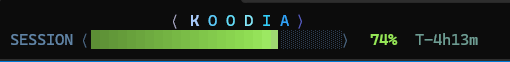

# ccbar

A sci-fi console bar for [Claude Code](https://claude.com/claude-code): your project name
animated at the **top** of the Windows Terminal window, with a session-limit gauge under it.



```
⟨ K O O D I A ⟩                      <- the bar, three rows at the top
SESSION ⟨████████████▋░░░░░░░⟩  74%  T-4h13m
─────────────────────────────────────────────
  Claude Code runs in the pane below
```

The pane you type `cc` in becomes a three-row bar at the top of the window, and Claude Code
opens beneath it. Where that split cannot apply, the same console is drawn as Claude Code's
ordinary status line instead, so a session is never left without a gauge.

## What it looks like

**The title** is one continuous gradient laid across the letters — ice, cyan, azure, violet,
magenta — never a random colour per letter. The gradient drifts slowly through the word while
a soft specular highlight glides across it, like a light bar travelling over chrome, over a
barely-there phosphor breath. The letters themselves never move.

**The gauge** uses a separate, warm language, because instrumentation should not look like
decoration: aqua → signal green → amber CRT → ember → alert red as the five-hour session
window drains. It fills in eighth-width blocks so the level glides instead of stepping,
darkens away from the leading edge for depth, and below ten percent it pulses on a smooth
sine. Cool title against a warm gauge: the frame idles calm until the meter starts to burn.

The top pane redraws at 20 fps and computes its animation locally, so it keeps breathing
while the session below is idle.

## Requirements

- [Claude Code](https://claude.com/claude-code)
- [Node.js](https://nodejs.org) (the bar and status line are dependency-free Node scripts)
- Windows Terminal — for the top bar. Without it you still get the status line.

## Install

```powershell
git clone https://github.com/<you>/ccbar.git
cd ccbar
powershell -ExecutionPolicy Bypass -File .\install.ps1
```

The `-ExecutionPolicy Bypass` is not a system change — it applies to that one PowerShell
process. A default Windows install runs scripts under `Restricted`, and without it the
installer would refuse to start.

Then open a **new** Windows Terminal tab and run:

```
cc
```

To make plain `claude` do the same thing, install with `-ShadowClaude`:

```powershell
powershell -ExecutionPolicy Bypass -File .\install.ps1 -ShadowClaude
```

That adds a `claude` shim ahead of `claude.exe` on PATH. It hands straight over to the real
binary whenever the layout cannot apply — outside Windows Terminal, inside an existing Claude
session, with non-interactive flags (`-p`, `--print`, `mcp`, …), or in a window under 16 rows.

### macOS / Linux

```sh
./install.sh
```

Status line only; the top bar is a Windows Terminal pane split with no equivalent here.

## What the installer touches

| Path | What |
| --- | --- |
| `~/.claude/ccbar/` | the scripts |
| `~/.claude/ccbar/bin/` | the `cc` (and optional `claude`) shim |
| user `PATH` | that bin directory, prepended — skip with `-NoPathEdit` |
| `~/.claude/settings.json` | a `statusLine` entry, with a timestamped backup |

No execution policy is changed, no PowerShell profile is written, nothing else is modified.

## Uninstall

```powershell
powershell -ExecutionPolicy Bypass -File .\uninstall.ps1
```

Removes the status line entry (only if it is ccbar's), the PATH entry and the install
directory.

## When the bar does not appear

```powershell
powershell -ExecutionPolicy Bypass -File .\doctor.ps1
```

Run it in the terminal where you would type `cc`. It checks every gate the launcher checks
and prints the verdict. The launcher also says its reason out loud in one grey line and
records it in `~/.claude/ccbar/state/launch.log`.

## How it works

```
cc.cmd ──> launch.js ──> split.ps1 ──> wt split-pane ──> run-claude.ps1 ──> claude
   (real console)  │                                          │ CCBAR_ID=<token>
                   └──> topbar.js  <── state/<token>.json <── statusline.js
```

- **launch.js** runs from a real console, so unlike anything Claude Code spawns it can see the
  terminal size. It splits the window, waits for the pane below to say it is up, then turns
  its own pane into the bar.
- **split.ps1** exists because `wt.exe` is a Windows App Execution Alias, and Node cannot
  launch it: from `node.exe` the stub returns exit 0 and does nothing at all — even
  `wt.exe --version` prints nothing. PowerShell resolves the alias correctly.
- **run-claude.ps1** names the session with `CCBAR_ID=<token>` and drops a `.started` marker.
  `wt.exe`'s own exit code cannot be trusted for that handshake: it hands the command to the
  running window and may report failure for a split that worked.
- **statusline.js** is Claude Code's status-line command. It publishes the session's name and
  limit under that token, and stays silent while a bar holds a fresh `.claim` beside it, so
  the console lives in exactly one place. With no bar attached it draws the console itself.
- **topbar.js** watches exactly its own token — never "the freshest session on the machine",
  which would attach to, and silence, another window's session.

### Built to survive Claude Code updates

Only the documented `statusLine` command contract is used: JSON on stdin, text on stdout.
Every field is probed under several plausible names — `rate_limits.five_hour.used_percentage`,
then `utilization`, then `remaining_percentage` — and falls back to the context window when a
plan limit is unavailable (API key, Bedrock, Vertex). Nothing throws; the worst case prints
the bare project name.

### One known limitation

A status-line command is spawned with no console, no `COLUMNS`, and no terminal size in its
payload, so it cannot know where the middle of the line is. The top pane can, and centres
there; the bottom status line centres only once something that *can* see the terminal has
recorded the width (the launcher does this on every start). Until then it draws flush left,
deliberately — a guessed centre looks broken, a left edge looks intended.

## License

MIT
